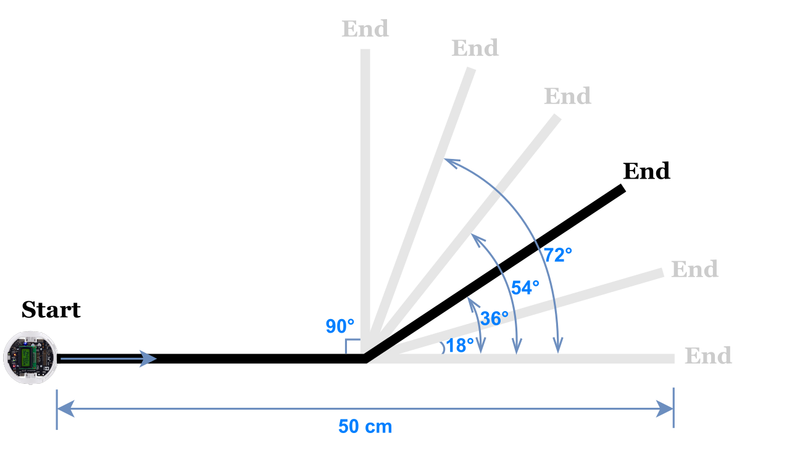

<!-- 

    

 -->

    

# Overview
Investigate the Relationship between Feedback Error and Line-Following Angle with a PID Controller on a [3pi+32U4](https://www.pololu.com/category/280/3pi-plus-32u4-oled-robot) robot
## Getting started
- [ ] Upload & run the code located in  [src](/src) in Arduino IDE
- [ ] Place to robot at the starting point, wait for it to finish the line following at the end point and stop.
- [ ] Within 10s, plug in the USB cable to the robot to recieve serial output from [src/recoder.h](/srcrecoder.h)
- [ ] Collect the data points and visualise it in [plot/robot_data.ipynb](plot/robot_data.ipynb)
***

## Line Following Paths

    

After uploading the code, experiment with the behaviour of the robot when turning at different angles and record their corresponding feedback error. You should expect to see more spikes in feedback error when the angle of the turning point is increased.
<!-- ## Usage -->

## License
[MIT](LICENSE)
